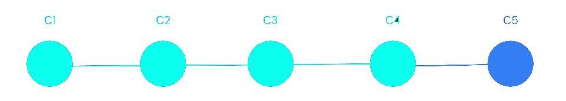
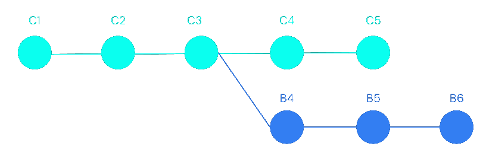
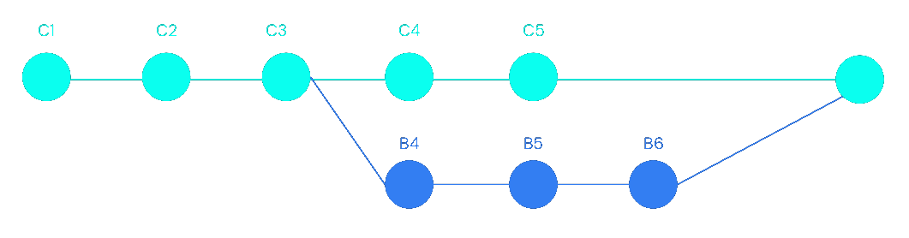
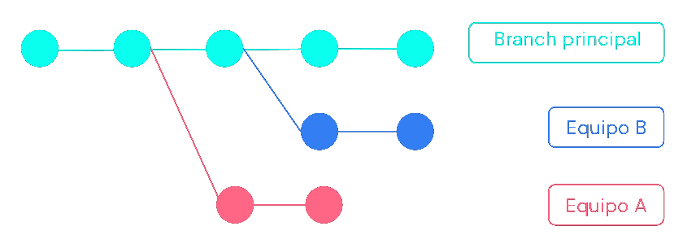
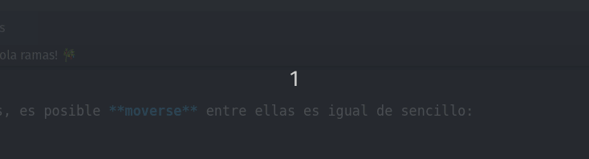
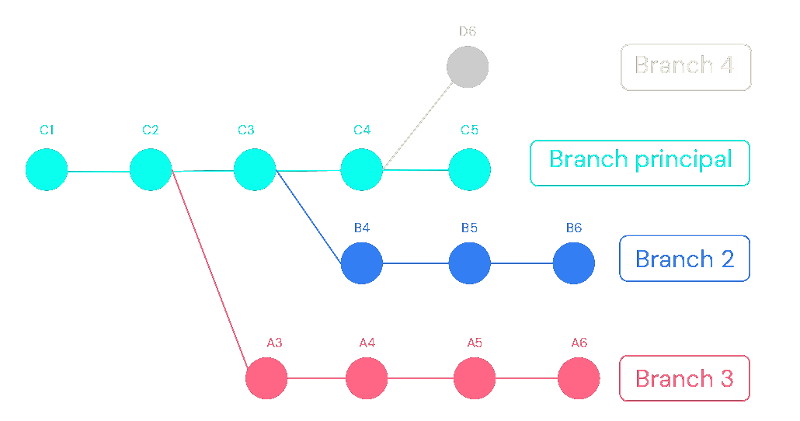
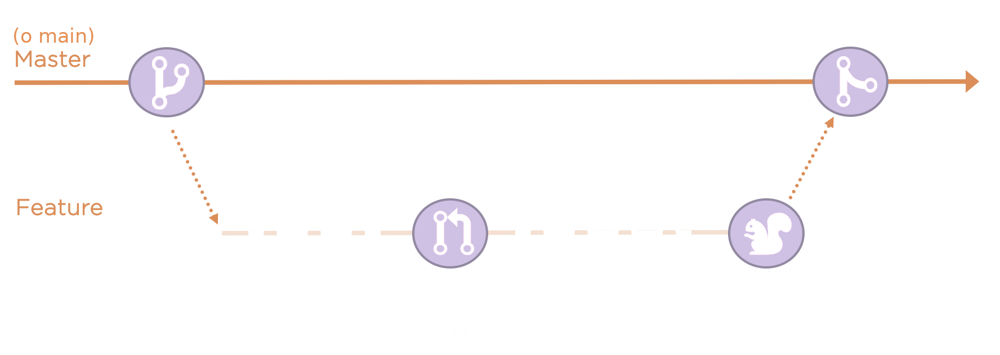

## Trabajo colaborativo en Git <!-- .element style="text-transform: uppercase" -->

#### Flujos de trabajo con ramas o _branches_


===

## Desarrollo **no** lineal

Según sus creadores, es una de las principales características de Git pero... ¿qué es? 🤔

--

<div style='position: relative; padding-bottom: 56.25%; padding-top: 35px; height: 0; overflow: hidden;'><iframe sandbox='allow-scripts allow-same-origin allow-presentation' allowfullscreen='true' allowtransparency='true' frameborder='0' height='315' src='https://www.mentimeter.com/app/presentation/dee0c4b4e6f6144719d5f7e720c1703d/b303f1b3f7a7/embed' style='position: absolute; top: 0; left: 0; width: 100%; height: 100%;' width='420'></iframe></div>

--

Cuando recién arrancamos con Git, probablemente ni siquiera nos demos cuenta de que siempre estamos trabajando sobre una **rama** (o _branch_ en inglés).

--

```shell [|2]
$ git status
On branch main
Changes not staged for commit:
  (use "git add <file>..." to update what will be committed)
  (use "git restore <file>..." to discard changes in working directory)
        modified:   package-lock.json
        modified:   public/img/merge.png
        modified:   public/index.md

no changes added to commit (use "git add" and/or "git commit -a")
```

Por defecto, esa rama se llama `master` o `main`.
<small>(depende de la versión de Git y la configuración de nuestro sistema)</small>

<!-- .element: class="fragment" -->

--

Al trabajar de esa manera, nuestro árbol de _commits_ será siempre **lineal**:



--

Excepto que estemos trabajando con alguien más, en cuyo caso los caminos se bifurcarán en algún momento...



--



...para luego volver a unirse en un _merge_.

--

El solo hecho de **trabajar en equipo** de manera asincrónica nos hará romper la **linealidad**: en algún momento van a **coexistir versiones diferentes** del código.


--

Esta capacidad de poder "deslinearizar" el desarrollo es muy poderosa, y nos da a pie a diferentes flujos que nos permiten **trabajar en paralelo** sin afectar al resto.



===

## ¡Hola ramas! 🎋

Además de esta forma "casual" de generar bifurcaciones, Git nos ofrece una herramienta para **bifurcar intencionalmente** el código.

Estas son las famosas **ramas** o _branches_.

--

Para **crearlas**, simplemente hay que darles un nombre:

```shell
$ git checkout -b nueva-rama
Switched to a new branch 'nueva-rama'
```

Luego, es posible **moverse** entre ellas usando _casi_ el mismo comando:

<!-- .element: class="fragment" -->

```shell
$ git checkout main
Switched to branch 'main'

$ git checkout nueva-rama
Switched to branch 'nueva-rama'
```

<!-- .element: class="fragment" -->

<small>(Nótese que en el segundo ejemplo omitimos el **`-b`**,
<br>necesario cuando queremos **crear** la rama)</small>

<!-- .element: class="fragment" -->

--

Incluso son tan usadas que la mayoría de los editores ofrecen formas simples de navegarlas y crearlas:



--

Al crear una rama, estamos creando una **"nueva versión"** del código, donde podremos programar **sin afectar a la versión principal**.

Esto nos permite trabajar con la **tranquilidad** de no romper el proyecto - al menos hasta que nuestra rama se integre. 😅

--

Y sí, podemos crear tantas como necesitemos.



===

## 👀 Demostración

Creemos y publiquemos una rama desde la consola.

===

## 🦾 Manos a la obra

1. Creen una rama.
2. Cambien algo en el archivo `README.md` y hagan un _commit_.
3. Suban sus cambios al repositorio (_push_).

```bash
# Crear rama
git checkout -b nombre-rama

# Pushear la rama actual
git push

# Cambiar de rama
git checkout otra-rama
```

===

## Usando las ramas

Si bien Git nos permite hacer cualquier cosa con las ramas, existen varias **convenciones** sobre cómo utilizarlas.

Cuáles usar dependerá, como siempre, de los **acuerdos** que hagamos dentro del equipo. 🙉 🙊

--

Algunas orientaciones generales:

- Usar nombres que **revelen su sentido**:
  - 👍 `nueva-pagina-login` / `error-suma-total` / `actualizacion-dependencias`
  - 👎 `fede` / `mi-branch` / `probando`
- **Integrar** lo antes posible.
- Hacer _pull_ regularmente de la **rama principal**.

--

Independientemente de cómo trabajemos, vamos a poder distinguir dos tipos de ramas:

- **principales:** como `main`, son ramas que perduran en el tiempo y desde donde generalmente partimos para crear otras.
- **secundarias o efímeras:** las creamos para resolver algo, y una vez terminadas se integran a una principal (o mueren en el camino).

===

## Volver a la base

Para que todo esto tenga sentido, tiene que haber una forma de "volver" a la rama principal, **integrando** los cambios que se hicieron en una rama secundaria.

Esto en Git se logra haciendo un _merge_, tal como hacíamos cuando ocurría un conflicto.

--

Si bien se puede hacer por consola, lo más simple hoy en día es usar los **_pull requests_** que nos ofrece GitHub.

Al crearlos, estamos **comunicando al equipo** que queremos que nuestra rama se **integre**.

--

Desde la interfaz de un _pull request_ (o simplemente, _PR_), podemos:

- Ver los **cambios**.
- Ejecutar **validaciones automáticas**.
- Pedir **revisión** a otra/s persona/s.
- Iniciar **conversaciones** directamente sobre el código.
- **Sugerir** modificaciones.
- Etc, etc, etc...

===

## 👀 Demostración

Hagamos un _pull request_.

===

## 🦾 Manos a la obra

Decidan quíen es A y quién es B, y luego:

- A **crea** un _pull request_.
- B le solicita cambios y **rechaza** el pull request.
- A **corrige** lo pedido, _commitea_ y _pushea_ los cambios.
- B hace el **_merge_** del _PR_.

===

## ¿Se acabaron los conflictos?

Claro que no. 😃

Si bien el uso de ramas ordena muchísimo el trabajo, **no elimina** la posibilidad de que ocurran conflictos.

--

Veamos un ejemplo:

> <small>En un sistema de una juguetería, Alicia está trabajando en una rama `descuentos-mes-infancias` y Beto está trabajando en otra `recargo-pago-mercadopago`.</small>
>
> <small>Ambas ramas partieron del mismo commit de `main` y terminan modificando el mismo archivo:</small>

```kotlin
// Alicia
fun total() = sumaProductos() - descuentoMesInfancias()

// Beto
fun total() = sumaProductos() + recargoMercadoPago()
```

**¿Qué pasará cuando hagan el _pull request_?**

<!-- .element: class="fragment" -->

===

## 🦾 Manos a la obra

1. Partiendo de `main`, crear una rama y modificar el mismo archivo que la otra persona.
2. Crear el _pull request_.
3. Mergear uno de los dos y ver que el otro da conflictos.
4. Solucionarlos y mergear el que quedaba.

===

## Flujos de trabajo

Como dijimos, hay muchas formas posibles de trabajar con ramas y todas tienen **ventajas** y **desventajas**.

Será tarea del equipo diseñar el flujo de trabajo que mejor se adecúe a su realidad.

--

Existen varios flujos de trabajo _conocidos_, entre los que destacan tres: **Git flow**, **GitHub flow** y **Trunk-based development**.

Siempre sugiero ir por lo más **simple** y luego complejizar si el escenario lo requiere.

--

Entre los mencionados, el que más he utilizado fue el **GitHub flow**, con pequeñas adaptaciones según los requerimientos no funcionales del sistema: cantidad y tipo de **ambientes**, frecuencia de **despliegue**, política de **revisión**, etc.

--

El flujo se basa en varias reglas que podemos resumir en la más importante: en todo momento, **lo que está en la rama principal es publicable**.



===

<div style='position: relative; padding-bottom: 56.25%; padding-top: 35px; height: 0; overflow: hidden;'><iframe sandbox='allow-scripts allow-same-origin allow-presentation' allowfullscreen='true' allowtransparency='true' frameborder='0' height='315' src='https://www.mentimeter.com/app/presentation/8b840352810ccc86fceed227b02d059a/9968195f9eeb/embed' style='position: absolute; top: 0; left: 0; width: 100%; height: 100%;' width='420'></iframe></div>

===

## Sorpresa 🎁

Para quienes completen las actividades, tenemos dos regalos:

- Una licencia de **GitKraken** por un año.
- **Stickers** y **folletos** de GitHub.

===

## ¡Gracias!

<div class="red-social">
  <i class="fab fa-youtube color"></i>
  <span><a href="https://youtube.com/c/elsurtambienprograma">El Sur también programa</a></span>
</div>
<div class="red-social">
  <i class="fab fa-telegram-plane color"></i>
  <span><a href="https://t.me/surprograma">@surprograma<a></span>
</div>
<div class="red-social">
  <i class="fab fa-instagram color"></i>
  <span><a href="https://instagr.am/surprograma">@surprograma<a></span>
</div>


